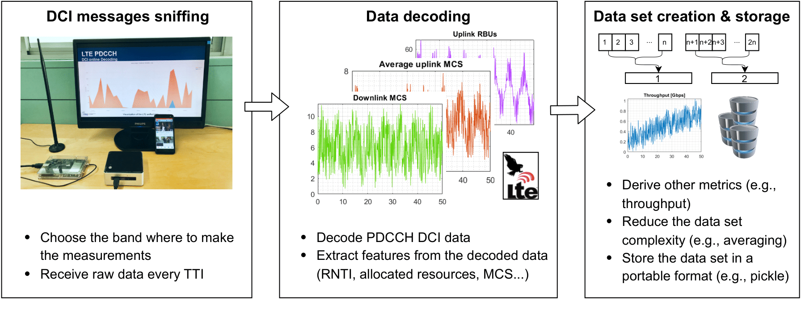
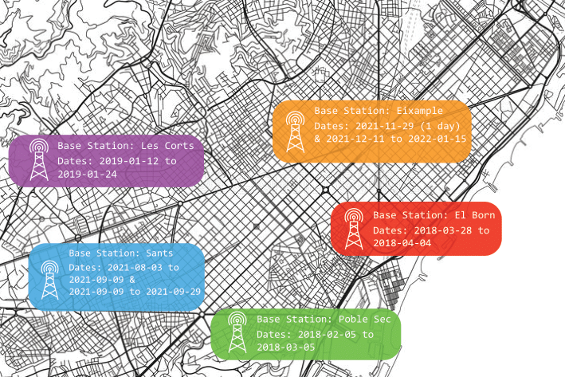
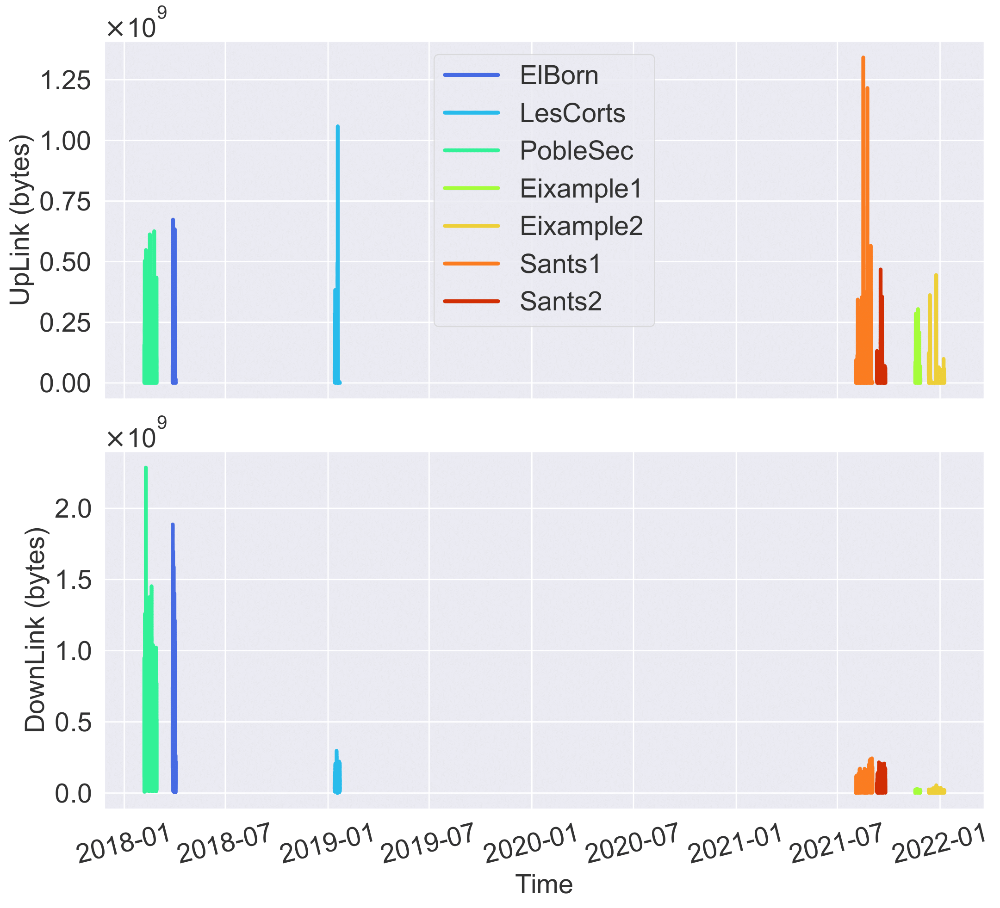

### Data Collection

The data used in this paper is framed within the [SUPERCOM](https://supercom.cttc.es/) initiative, which aims to provide a comprehensive set of tools that range from the collection to the interpretation of network-related data. The dataset comprises heterogeneous measurements from different cellular base stations in the city of Barcelona, Spain.

Specifically, the measurements were retrieved from Downlink Control Information (DCI) messages, which are transmitted through the PDCCH every Transmission Time Interval (TTI), e.g., every one millisecond. DCI messages include information to perform resource allocation in the physical layer, such as modulation and coding schemes (MSCs) and resource block (RB) allocations for both downlink and uplink channel and for each user. Since users are identified with radio network temporary identifiers (RNTIs), their identity remains anonymous and is free of privacy concerns. Likewise, the information carried by DCI messages is very useful to derive the utilization of a base station, thus allowing for forecasting optimization mechanisms.

The entire data collection procedure is illustrated in the Figure below. First, a software-defined radio (SDR), namely Nuand BladeRF x40, is used to capture frames from the PDCCH. The captured frames are decoded by OWL, an open-source software tool. Finally, the raw data is processed and stored. The processing operations include the derivation of complementary performance indicators (e.g., uplink/downlink throughput) and the downsampling of the dataset by combining multiple consecutive samples (e.g., averaging data over windows). The resulting features are described in the Table below.

**Table: Set of features captured in the LTE PDCCH dataset.**

| Feature | Description |
|---------|-------------|
| `RB_dl` | The average number of allocated resource blocks in the downlink. |
| `σ²(RB_dl)` | The normalized variance of `RB_dl`. |
| `RB_ul` | The average number of allocated resource blocks in the uplink. |
| `σ²(RB_ul)` | The normalized variance of `RB_ul`. |
| `RNTI_c` | The average RNTI counter, indicating the average number of users observed, during the selected time window. |
| `MCS_dl` | The average Modulation and Coding Scheme (MCS) index in the downlink (in 0-31). |
| `σ²(MCS_dl)` | The normalized variance of the MCS index in the downlink. |
| `MCS_ul` | The average MCS index in the uplink (in 0-31). |
| `σ²(MCS_ul)` | The normalized variance of the MCS index in the uplink. |
| `TB_dl` | The downlink transport block size in bits. |
| `TB_ul` | The uplink transport block size in bits. |

Following the aforementioned data collection approach, we gathered data from different locations in Barcelona (Spain), thus aiming to provide unique network utilization patterns, including daily living and special events. The set of studied locations are as follows (see also Figure below):

- **Les Corts - Camp Nou (LCCM):** A residential area nearby Camp Nou (Football Club Barcelona's stadium), which regularly hosts soccer matches and other special events. Measurements at this location comprise 12 days (from 2019-01-12 17:12h to 2019-01-24 16:20h), including three soccer matches.
- **Poble Sec (PS):** A residential area enclosed between strategic points, including the historic center, the mountain of Montjuïc, the port. Measurements at this location comprise 28 days (from 2018-02-05 23:40h to 2018-03-05 15:16h).
- **El Born (EB):** A touristic area which is adjacent to the city's old center. It is characterized by having a lot of amusement and nightlife. Measurements at this location comprise 7 days (from 2018-03-28 15:56h to 2018-04-04 22:36h).
- **Sants (S):** A residential area with the biggest train station of the city, near Les Corts and L'Hospitalet. Measurements were collected at two distinct temporal intervals, collectively spanning a duration of 58 days.
- **Eixample (E):** Located in the heart of the city, this is a residential area with relevant touristic interest points (e.g., La Sagrada Familia).

### Dataset Processing

We parse, reorganize, and downsample the datasets with the granularity of two minutes to reduce the effect of the missing values present in the raw datasets. In fact, the data collection phase can incur decodification errors, resulting in missing values for the variables stored in the messages. To further reduce the entries without values, we remove the instances in which at least one variable was missing, for a total of roughly seventeen minutes from PS, six minutes from EB, and nine minutes from LC, which represent less than 2‰ of the original datasets. Thus, downsampling allows to reduce the number of instances in which we miss the value of the variables for the whole time window and, in turns, enables the usage of DL schemes.

### Dataset Analysis

In our short analysis we examine the data distributions for each base station, as illustrated in the Figure below. Notably, the data exhibit three distinct skews in terms of quantity, quality, and temporality across the base stations. The amount of data (quantity skew) varies significantly among base stations, with Sants1 recording the highest number of measurements (26555) and El Born the lowest (5241). Additionally, substantial variations exist in the statistical distributions (quality skew) of Downlink and Uplink variables across the base stations, with unique patterns emerging under various circumstances. Finally, the data collection spans different time periods (temporal skew), from January 2018 to January 2022.

